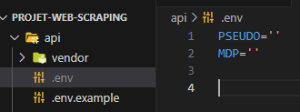

# projet-web-scraping

Ce projet a pour objectif de construire en PHP une collecte de données boursières pour un entreppôt de données

## Prérequis
>- PHP: https://www.php.net/downloads
>```bash
># vérifie que PHP est installé
># doit retouner le numéro de version
>php -v
>```

>- Chrome portable (port 9222) : https://portableapps.com/apps/internet/google_chrome_portable

>- XAMPP: https://www.apachefriends.org/fr/download.html. Veuillez lancer **Apache** et **MySQL**.

>- phpMyAdmin, possibilité de l'obtenir en local avec XAMPP, sinon : https://www.phpmyadmin.net. Créer les tables **Action** et **Forum** grâce au script SQL suivant :
>```SQL
>CREATE TABLE Action(
>   Id_Action INT PRIMARY KEY NOT NULL AUTO_INCREMENT,
>   code VARCHAR(50),
>   label VARCHAR(50),
>   last VARCHAR(50),
>   dateHours VARCHAR(50),
>   aClose VARCHAR(50),
>   aOpen VARCHAR(50),
>   currency VARCHAR(50),
>   high VARCHAR(50),
>   low VARCHAR(50),
>   totalVolume VARCHAR(50),
>   ticket VARCHAR(50),
>   endOfTheDay VARCHAR(50)
>);
>
>CREATE TABLE Forum(
>   Id_Forum INT PRIMARY KEY NOT NULL AUTO_INCREMENT,
>   codeAction VARCHAR(50),
>   auteur VARCHAR(50),
>   dateForum VARCHAR(50),
>   hoursForum VARCHAR(50),
>   content VARCHAR(50)
>);
>```

## Commencer

**Etape 1: Récupérer le projet**
>* Choix 1 : Placez-vous dans votre répertoire xampp/htdocs, puis cloner le projet avec la commande ci-dessous (git requis: https://git-scm.com/downloads).
>```bash
>git clone https://github.com/lege0053/projet-web-scraping.git
>```
>* Choix 2 : Dézipper le projet dans votre répertoire xampp/htdocs.

**Etape 2: Configation**
>- Mettre à jour, si besoin, la ligne du fichier projet-web-scraping/front/src/MyPDO.php ci-dessous : 
>```php
>MyPDO::setConfiguration('mysql:host=localhost;dbname=scraping;charset=utf8', 'admin','root');
>```
>- Dupliquer le fichier `.env.example` dans api/ et le renommer `.env` comme ci-dessous : 
>
>- Compléter `PSEUDO=''` et `MDP=''` avec votre propre compte membre boursorama, ou bien avec les valeurs données dans le rapport (demander l'accessibilité si nécessaire).

**Etape 3: Lancer l'application**
>- Ouvrir http://localhost/projet-web-scraping/front/home
>- Ouvrir GoogleChromePortable.exe pour permettre le scraping
